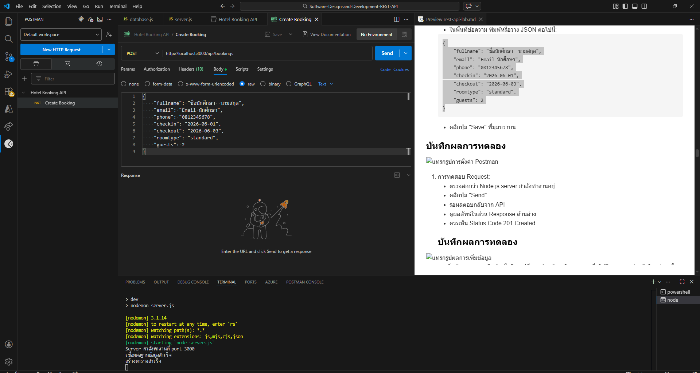
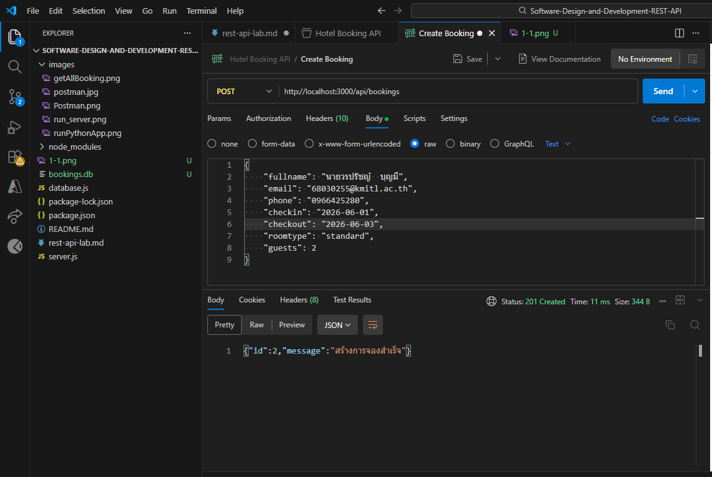
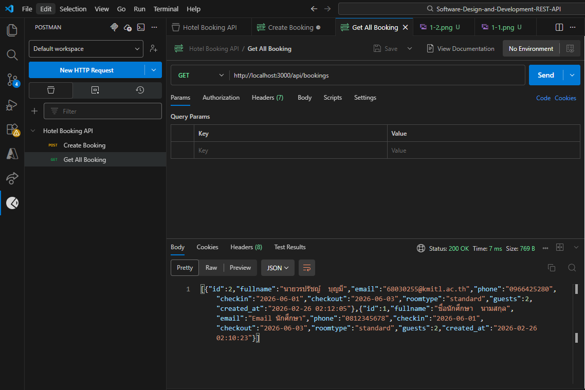
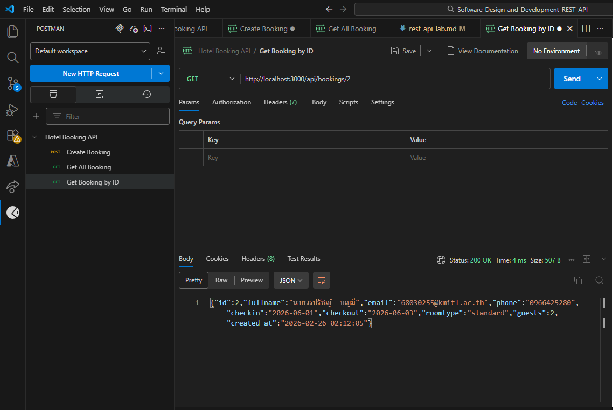
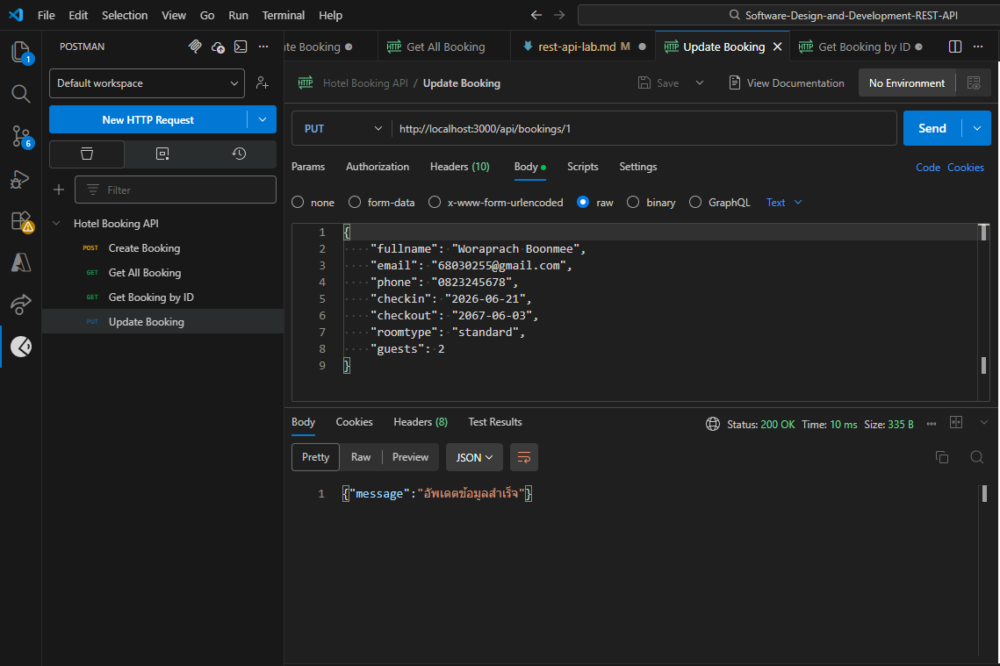

# การพัฒนา REST API สำหรับระบบจองห้องพัก

## ทฤษฎีที่เกี่ยวข้อง

### 1. REST API คืออะไร?
REST (Representational State Transfer) API(Application Programming Interface) เป็นมาตรฐานในการสร้าง API ที่ใช้ในการสื่อสารระหว่างคอมพิวเตอร์ผ่านโปรโตคอล HTTP โดยมีหลักการสำคัญดังนี้:

1. **หลักการทำงานของ REST API**
   - ใช้ HTTP Methods (GET, POST, PUT, DELETE) ในการจัดการข้อมูล
   - ส่งข้อมูลในรูปแบบ JSON หรือ XML
   - ไม่เก็บสถานะของผู้ใช้ (Stateless)
   - มีโครงสร้าง URL ที่เป็นระเบียบ

2. **HTTP Methods ที่ใช้ใน REST API**
   - GET: ใช้ดึงข้อมูล (Read)
   - POST: ใช้สร้างข้อมูลใหม่ (Create)
   - PUT: ใช้อัพเดตข้อมูลที่มีอยู่ (Update)
   - PATCH: ใช้อัพเดตข้อมูลบางส่วน (Partial Update)
   - DELETE: ใช้ลบข้อมูล (Delete)

3. **Status Codes ที่สำคัญ**
   - 200: OK (สำเร็จ)
   - 201: Created (สร้างสำเร็จ)
   - 204: No Content (สำเร็จ แต่ไม่มีข้อมูลตอบกลับ เช่น การลบข้อมูล)
   - 400: Bad Request (คำขอไม่ถูกต้อง เช่น ข้อมูลไม่ครบ)
   - 401: Unauthorized (ยังไม่ได้ยืนยันตัวตน)
   - 403: Forbidden (ไม่มีสิทธิ์เข้าถึง)
   - 404: Not Found (ไม่พบข้อมูล)
   - 500: Internal Server Error (เซิร์ฟเวอร์ผิดพลาด)

### 2. Postman คืออะไร?
Postman เป็นเครื่องมือที่ใช้ในการทดสอบ API โดยมีคุณสมบัติดังนี้:

1. **ความสามารถหลักของ Postman**
   - ส่ง HTTP Requests ไปยัง API
   - จัดการ Collections ของ Requests
   - ทดสอบ API แบบอัตโนมัติ
   - สร้างเอกสาร API
   - แชร์ Collections กับทีม

2. **ส่วนประกอบสำคัญของ Postman**
   - Request URL: ที่อยู่ของ API
   - HTTP Method: วิธีการเรียก API
   - Headers: ข้อมูลเพิ่มเติมของ Request
   - Body: ข้อมูลที่ส่งไปกับ Request
   - Collections: กลุ่มของ Requests

3. **ประโยชน์ของ Postman**
   - ทดสอบ API ได้ง่าย
   - บันทึกและจัดการ Requests
   - สร้างชุดทดสอบอัตโนมัติ
   - แชร์และทำงานร่วมกันในทีม

## การทดลองที่ 1: การพัฒนา REST API ด้วย Node.js

### 1.1 การติดตั้งและตั้งค่าสภาพแวดล้อม

#### 1.1.1 การเตรียม Visual Studio Code
1. เปิด Visual Studio Code
   - คลิกที่ไอคอน Visual Studio Code บนเดสก์ท็อป หรือ
   - ค้นหา "Visual Studio Code" ในเมนู Start (Windows)

2. เปิดโฟลเดอร์สำหรับโปรเจค
   - คลิกที่เมนู File > Open Folder หรือ
   - กด Ctrl+K Ctrl+O (Windows/Linux) หรือ Cmd+K Cmd+O (macOS)
   - เลือกตำแหน่งที่ต้องการสร้างโปรเจค เช่น Documents/projects

3. สร้างโฟลเดอร์ใหม่สำหรับโปรเจค
   - คลิกขวาในพื้นที่ Explorer ด้านซ้าย (เลือก icon Exploer ที่อยู่มุมบนด้านซ้าย หลังจากนั้น คลิกขวาในพื้นที่ว่าง ๆ ของพื้นที่แสดงชื่อไฟล์)
   - เลือก New Folder
   - ตั้งชื่อโฟลเดอร์เป็น "hotel-booking-api-node"
   - คลิกเลือกโฟลเดอร์ที่สร้าง

#### 1.1.2 การเปิด Terminal ใน VS Code
1. เปิด Terminal ใหม่
   - กด Ctrl+` (Windows/Linux) หรือ control+` (macOS) หรือ
   - ไปที่เมนู Terminal > New Terminal

2. ตรวจสอบว่า Terminal อยู่ในโฟลเดอร์ที่ถูกต้อง
   - สังเกตพาธที่แสดงใน Terminal ควรลงท้ายด้วย hotel-booking-api-node
   - หากไม่ถูกต้อง ใช้คำสั่ง `cd` เพื่อเปลี่ยนไปยังโฟลเดอร์ที่ถูกต้อง

#### 1.1.3 การตรวจสอบการติดตั้ง Node.js
1. ตรวจสอบ Node.js:
```bash
node --version
```
- หากติดตั้งแล้ว จะเห็นเลขเวอร์ชัน เช่น v22.14.0
- หากไม่พบ ให้ดาวน์โหลดและติดตั้ง Node.js จาก https://nodejs.org

2. ตรวจสอบ npm:
```bash
npm --version
```
- ควรเห็นเลขเวอร์ชัน เช่น 10.9.2

#### 1.1.4 การสร้างโปรเจค Node.js
1. เริ่มต้นโปรเจคใหม่:
```bash
npm init -y
```
- คำสั่งนี้จะสร้างไฟล์ package.json

2. ตรวจสอบไฟล์ package.json:
   - เปิดไฟล์ package.json ในโฟลเดอร์โปรเจค
   - ควรเห็นข้อมูลพื้นฐานของโปรเจค

#### 1.1.5 การติดตั้ง Dependencies
1. ติดตั้ง Express และ packages ที่จำเป็น:
```bash
npm install express sqlite3 cors
```
- รอจนการติดตั้งเสร็จสิ้น
- ควรเห็นโฟลเดอร์ node_modules ถูกสร้างขึ้น

> 💡 **หมายเหตุ:** ตั้งแต่ Express เวอร์ชัน 4.16+ เป็นต้นมา ไม่จำเป็นต้องติดตั้ง `body-parser` แยกต่างหากอีกแล้ว เนื่องจาก Express มี `express.json()` ในตัว

2. ติดตั้ง nodemon สำหรับการพัฒนา:
```bash
npm install --save-dev nodemon
```

3. เปิดไฟล์ package.json และเพิ่มโค้ดตั้งแต่ ,"scripts": {...} ลงไปในไฟล์:
```json
{
  "dependencies": {
    "cors": "^2.8.5",
    "express": "^4.21.2",
    "sqlite3": "^5.1.7"
  },
  "devDependencies": {
    "nodemon": "^3.1.9"
  },
  "scripts": {
    "start": "node server.js",
    "dev": "nodemon server.js"
  }
}
```

- บันทึกไฟล์ (Ctrl+S หรือ Cmd+S)

#### 1.1.6 การสร้างโครงสร้างไฟล์โปรเจค
1. สร้างไฟล์ใหม่สำหรับฐานข้อมูล:
   - คลิกขวาใน Explorer
   - เลือก New File
   - ตั้งชื่อเป็น "database.js"

2. สร้างไฟล์สำหรับ server:
   - สร้างไฟล์ใหม่ชื่อ "server.js"


### 1.2 การสร้างฐานข้อมูล

เขียนโค้ดไฟล์ `database.js` ดังนี้:
```javascript
const sqlite3 = require('sqlite3').verbose();

// สร้างการเชื่อมต่อกับฐานข้อมูล
const db = new sqlite3.Database('bookings.db', (err) => {
    if (err) {
        console.error('เกิดข้อผิดพลาดในการเชื่อมต่อฐานข้อมูล:', err);
    } else {
        console.log('เชื่อมต่อฐานข้อมูลสำเร็จ');
        createTable();
    }
});

// สร้างตาราง bookings
const createTable = () => {
    const sql = `
    CREATE TABLE IF NOT EXISTS bookings (
        id INTEGER PRIMARY KEY AUTOINCREMENT,
        fullname TEXT NOT NULL,
        email TEXT NOT NULL,
        phone TEXT NOT NULL,
        checkin DATE NOT NULL,
        checkout DATE NOT NULL,
        roomtype TEXT NOT NULL,
        guests INTEGER NOT NULL,
        created_at TIMESTAMP DEFAULT CURRENT_TIMESTAMP
    )`;

    db.run(sql, (err) => {
        if (err) {
            console.error('เกิดข้อผิดพลาดในการสร้างตาราง:', err);
        } else {
            console.log('สร้างตารางสำเร็จ');
        }
    });
};

module.exports = db;
```

### 1.3 การสร้าง REST API

สร้างไฟล์ `server.js`:
```javascript
const express = require('express');
const cors = require('cors');
const db = require('./database');

const app = express();
const port = 3000;

// Middleware — ใช้ express.json() แทน body-parser (Express 4.16+)
app.use(cors());
app.use(express.json());

// ฟังก์ชันตรวจสอบข้อมูลที่จำเป็น
const validateBookingData = (data) => {
    const required = ['fullname', 'email', 'phone', 'checkin', 'checkout', 'roomtype', 'guests'];
    return required.filter(field => !data[field]);
};

// สร้างการจองใหม่ (Create)
app.post('/api/bookings', (req, res) => {
    const missingFields = validateBookingData(req.body);
    if (missingFields.length > 0) {
        return res.status(400).json({ error: `กรุณากรอกข้อมูลให้ครบถ้วน: ${missingFields.join(', ')}` });
    }

    const { fullname, email, phone, checkin, checkout, roomtype, guests } = req.body;
    
    const sql = `INSERT INTO bookings (fullname, email, phone, checkin, checkout, roomtype, guests)
                 VALUES (?, ?, ?, ?, ?, ?, ?)`;
    
    db.run(sql, [fullname, email, phone, checkin, checkout, roomtype, guests], function(err) {
        if (err) {
            res.status(400).json({ error: err.message });
            return;
        }
        
        res.status(201).json({
            id: this.lastID,
            message: "สร้างการจองสำเร็จ"
        });
    });
});

// ดึงข้อมูลการจองทั้งหมด (Read)
app.get('/api/bookings', (req, res) => {
    const sql = "SELECT * FROM bookings ORDER BY created_at DESC";
    
    db.all(sql, [], (err, rows) => {
        if (err) {
            res.status(400).json({ error: err.message });
            return;
        }
        res.json(rows);
    });
});

// ดึงข้อมูลการจองตาม ID (Read)
app.get('/api/bookings/:id', (req, res) => {
    const sql = "SELECT * FROM bookings WHERE id = ?";
    
    db.get(sql, [req.params.id], (err, row) => {
        if (err) {
            res.status(400).json({ error: err.message });
            return;
        }
        if (!row) {
            res.status(404).json({ error: "ไม่พบข้อมูลการจอง" });
            return;
        }
        res.json(row);
    });
});

// อัพเดตข้อมูลการจอง (Update)
app.put('/api/bookings/:id', (req, res) => {
    const missingFields = validateBookingData(req.body);
    if (missingFields.length > 0) {
        return res.status(400).json({ error: `กรุณากรอกข้อมูลให้ครบถ้วน: ${missingFields.join(', ')}` });
    }

    const { fullname, email, phone, checkin, checkout, roomtype, guests } = req.body;
    
    const sql = `UPDATE bookings 
                 SET fullname = ?, email = ?, phone = ?, 
                     checkin = ?, checkout = ?, roomtype = ?, guests = ?
                 WHERE id = ?`;
    
    db.run(sql, [fullname, email, phone, checkin, checkout, roomtype, guests, req.params.id], 
        function(err) {
            if (err) {
                res.status(400).json({ error: err.message });
                return;
            }
            if (this.changes === 0) {
                res.status(404).json({ error: "ไม่พบข้อมูลการจอง" });
                return;
            }
            res.json({ message: "อัพเดตข้อมูลสำเร็จ" });
    });
});

// ลบข้อมูลการจอง (Delete)
app.delete('/api/bookings/:id', (req, res) => {
    const sql = "DELETE FROM bookings WHERE id = ?";
    
    db.run(sql, [req.params.id], function(err) {
        if (err) {
            res.status(400).json({ error: err.message });
            return;
        }
        if (this.changes === 0) {
            res.status(404).json({ error: "ไม่พบข้อมูลการจอง" });
            return;
        }
        res.json({ message: "ลบข้อมูลสำเร็จ" });
    });
});

// เริ่มต้น server
app.listen(port, () => {
    console.log(`Server กำลังทำงานที่ port ${port}`);
});
```
### 1.4 การรัน REST API Server
 รันเซิร์ฟเวอร์ ด้วยคำสั่ง:
```bash
npm run dev
```
ผลลัพธ์จะแสดง 

  
### 1.5 การทดสอบ API ด้วย Postman

> 💡 **ทางเลือกสำหรับการทดสอบ API:** นอกจาก Postman แล้ว ยังมีเครื่องมืออื่นที่ใช้ทดสอบ API ได้สะดวกกว่า:
> - **Thunder Client** — Extension ใน VS Code ที่ใช้ได้เลยโดยไม่ต้องติดตั้งโปรแกรมเพิ่ม ค้นหาใน Extensions (`Ctrl+Shift+X`) พิมพ์ "Thunder Client"
> - **Bruno** — โปรแกรม Open Source ไม่ต้องสร้างบัญชี ดาวน์โหลดได้ที่ https://www.usebruno.com
> - **Hoppscotch** — ใช้งานผ่านเว็บได้เลยที่ https://hoppscotch.io
>
> หากใช้ Thunder Client ข้ามขั้นตอนการติดตั้ง Postman ได้เลย

#### 1. การติดตั้ง Postman Desktop Application

1. ดาวน์โหลด Postman:
   - เปิดเบราว์เซอร์และไปที่ https://www.postman.com/downloads/
   - มองหาและคลิกปุ่ม "Download for Windows/Mac/Linux" (เลือกตามระบบปฏิบัติการที่ใช้)
   - รอการดาวน์โหลดเสร็จสิ้น (ไฟล์มีขนาดประมาณ 100MB+)

2. ติดตั้ง Postman:
   สำหรับ Windows:
   - เปิดไฟล์ที่ดาวน์โหลดมา (Postman-win64-Setup.exe)
   - หากมีหน้าต่าง Security Warning ให้คลิก "Run" หรือ "Yes"
   - รอการติดตั้งเสร็จสิ้น (อาจใช้เวลา 2-3 นาที)
   - Postman จะเปิดขึ้นมาโดยอัตโนมัติ

   สำหรับ macOS:
   - เปิดไฟล์ที่ดาวน์โหลดมา (.dmg)
   - ลาก Postman ไปยังโฟลเดอร์ Applications
   - ดับเบิลคลิกที่ Postman ในโฟลเดอร์ Applications

3. การตั้งค่าเริ่มต้น:
   - เมื่อเปิด Postman ครั้งแรก จะพบหน้าต่าง Welcome
   - คลิก "Create Account" หรือใช้บัญชี Google เพื่อเข้าสู่ระบบ
   - กรอกข้อมูลที่จำเป็น (ชื่อ, อีเมล, รหัสผ่าน)
   - เลือก "Skip" เมื่อมีหน้าต่างแนะนำฟีเจอร์ต่างๆ

#### 2. การสร้าง Collection และ Request


1. การสร้าง Collection:
   - มองหาแถบด้านซ้ายของ Postman
   - หาหัวข้อ "Collections"
   - คลิกที่ปุ่ม "+" (New) ข้างๆคำว่า Collections
   - พิมพ์ชื่อ "Hotel Booking API"
   - คลิกปุ่ม "Create"

2. การสร้าง Request แรก (POST - สร้างการจอง):
   - คลิกขวาที่ Collection "Hotel Booking API"
   - เลือก "Add Request"
   - พิมพ์ชื่อ Request: "Create Booking"
   - คลิก "Save"
   - มองหาดรอปดาวน์ Method ด้านซ้ายของช่อง URL
   - คลิกและเลือก "POST"
   - ในช่อง URL พิมพ์: http://localhost:3000/api/bookings

3. การตั้งค่า Headers (Optional):
   - มองหาแท็บ "Headers" ใต้ช่อง URL
   - คลิกที่แท็บ Headers
   - ในช่อง KEY พิมพ์: Content-Type
   - ในช่อง VALUE พิมพ์: application/json
   - สังเกตว่า Postman จะแสดง Header เป็นสีส้ม แสดงว่าถูกต้อง

4. การตั้งค่า Body:
   - คลิกที่แท็บ "Body"
   - เลือกตัวเลือก "raw"
   - คลิกดรอปดาวน์ที่เขียนว่า "Text" และเลือก "JSON"
   - ในพื้นที่ข้อความ พิมพ์หรือวาง JSON ต่อไปนี้:
   ```json
   {
       "fullname": "ชื่อนักศึกษา  นามสกุล",
       "email": "Email นักศึกษา",
       "phone": "0812345678",
       "checkin": "2026-06-01",
       "checkout": "2026-06-03",
       "roomtype": "standard",
       "guests": 2
   }
   ```
   - คลิกปุ่ม "Save" ที่มุมขวาบน
     
  ### บันทึกผลการทดลอง
  
1. การทดสอบ Request:
   - ตรวจสอบว่า Node.js server กำลังทำงานอยู่
   - คลิกปุ่ม "Send"
   - รอผลตอบกลับจาก API
   - ดูผลลัพธ์ในส่วน Response ด้านล่าง
   - ควรเห็น Status Code 201 Created
  
   ### บันทึกผลการทดลอง
  
  ทดสอบเพิ่มข้อมูลการจองอีก 2 ครั้ง โดยเปลี่ยนแปลงข้อมูลในการจองเพื่อให้มีความแตกต่างกันในแต่ละครั้ง
  

2. การสร้าง Request อื่นๆ:
   ทำตามขั้นตอนต่อไปนี้สำหรับแต่ละ Request:

   a) Get All Bookings:
   - สร้าง Request ใหม่ชื่อ "Get All Bookings"
   - เลือก Method: GET
   - URL: http://localhost:3000/api/bookings

  ### บันทึกผลการทดลอง
  

   b) Get Booking by ID:
   - สร้าง Request ใหม่ชื่อ "Get Booking by ID"
   - เลือก Method: GET
   - URL: http://localhost:3000/api/bookings/1
   (เปลี่ยนเลข 1 เป็น ID ที่ได้จากการสร้างข้อมูล)

  ### บันทึกผลการทดลอง
  

   c) Update Booking:
   - สร้าง Request ใหม่ชื่อ "Update Booking"
   - เลือก Method: PUT
   - URL: http://localhost:3000/api/bookings/1
   - ตั้งค่า Headers และ Body เหมือน Create Booking
   - แก้ไขข้อมูลบางส่วนใน JSON

  ### บันทึกผลการทดลอง
  

   d) Delete Booking:
   - สร้าง Request ใหม่ชื่อ "Delete Booking"
   - เลือก Method: DELETE
   - URL: http://localhost:3000/api/bookings/1
  
### บันทึกผลการทดลอง
  

  ### หยุดการทำงานของ API Server โดยกดปุ่ม Ctrl + c


## การทดลองที่ 2: การพัฒนา REST API ด้วยภาษา Python

### 2.1 การติดตั้งและตั้งค่าสภาพแวดล้อมการพัฒนาด้วย Python
#### 1. การดาวน์โหลด Python (กรณีมีการติดตั้งไว้แล้ว ข้ามขั้นตอนนี้)
1. เข้าไปที่เว็บไซต์ https://www.python.org/downloads/
2. คลิกปุ่ม "Download Python 3.x.x" (เลือกเวอร์ชันล่าสุด)
3. เลือกตัวติดตั้งที่เหมาะกับระบบปฏิบัติการ:
   - Windows: ดาวน์โหลดไฟล์ .exe
   - macOS: ดาวน์โหลดไฟล์ .pkg
   - Linux: ใช้คำสั่ง package manager

#### 2. การติดตั้งบน Windows
1. เปิดไฟล์ที่ดาวน์โหลดมา
2. ทำเครื่องหมายที่ "Add Python 3.x to PATH" (สำคัญมาก)
3. คลิก "Install Now"
4. รอการติดตั้งเสร็จสิ้น
5. คลิก "Close"
#### 3. ตรวจสอบการติดตั้ง:
   - เปิด Command Prompt หรือ PowerShell ใหม่
   - พิมพ์คำสั่ง:
     ```bash
     python --version
     pip --version
     ```
   - ควรเห็นเวอร์ชันของ Python และ pip
#### กรณีที่ไม่สามารถเรียกใช้คำสั่ง python ได้ ให้ทำการตั้งค่า Environment Variables บน Windows
1. เปิด System Properties:
   - คลิกขวาที่ This PC/My Computer
   - เลือก Properties
   - คลิก "Advanced system settings"

2. ตั้งค่า Path:
   - คลิก "Environment Variables"
   - ในส่วน "System variables" หา "Path"
   - คลิก "Edit"
   - คลิก "New"
   - เพิ่มพาธของ Python และ Scripts:
     ```
     C:\Users\[YourUsername]\AppData\Local\Programs\Python\Python3x
     C:\Users\[YourUsername]\AppData\Local\Programs\Python\Python3x\Scripts
     ```
     แทน [YourUsername] ด้วยชื่อ user ที่เข้าใช้ระบบ Windows
   - คลิก "OK" ทุกหน้าต่าง


#### 4 การติดตั้งบน macOS
1. เปิดไฟล์ .pkg ที่ดาวน์โหลดมา
2. ทำตามขั้นตอนการติดตั้ง
3. ตรวจสอบการติดตั้งใน Terminal:
   ```bash
   python3 --version
   pip3 --version
   ```

#### 5 การติดตั้งบน Linux (Ubuntu)
1. อัพเดท package manager:
   ```bash
   sudo apt update
   sudo apt upgrade
   ```

2. ติดตั้ง Python:
   ```bash
   sudo apt install python3
   sudo apt install python3-pip
   ```

3. ตรวจสอบการติดตั้ง:
   ```bash
   python3 --version
   pip3 --version
   ```
### 2.2 สร้าง Virtual Environment:
1. พิมพ์คำสั่งสร้าง virtual environment
```bash
python -m venv venv       # กรณี macOS ให้ระบุเป็น python3 -m venv venv
source venv/bin/activate  # สำหรับ Linux/macOS
# หรือ
venv\Scripts\activate     # สำหรับ Windows
```

2. ติดตั้ง dependencies:
```bash
pip install flask flask-cors
```

### 2.3 การสร้าง REST API

สร้างไฟล์ `app.py`:
```python
from flask import Flask, request, jsonify
from flask_cors import CORS
import sqlite3
from datetime import datetime

app = Flask(__name__)
CORS(app)

# ตั้งค่า port ที่แตกต่างจาก Node.js
PORT = 5000

REQUIRED_FIELDS = ['fullname', 'email', 'phone', 'checkin', 'checkout', 'roomtype', 'guests']

def dict_factory(cursor, row):
    d = {}
    for idx, col in enumerate(cursor.description):
        d[col[0]] = row[idx]
    return d

def validate_booking_data(data):
    """ตรวจสอบว่าข้อมูลครบถ้วนหรือไม่ คืนค่า list ของ field ที่ขาดหาย"""
    return [field for field in REQUIRED_FIELDS if not data.get(field)]

def create_table():
        conn = sqlite3.connect('bookings.db')
        conn.row_factory = dict_factory
        c = conn.cursor()
        sql= '''CREATE TABLE IF NOT EXISTS bookings (
        id INTEGER PRIMARY KEY AUTOINCREMENT,
        fullname TEXT NOT NULL,
        email TEXT NOT NULL,
        phone TEXT NOT NULL,
        checkin DATE NOT NULL,
        checkout DATE NOT NULL,
        roomtype TEXT NOT NULL,
        guests INTEGER NOT NULL,
        created_at TIMESTAMP DEFAULT CURRENT_TIMESTAMP)'''
        c.execute(sql)
        conn.commit()
        conn.close()

create_table()

# สร้างการจอง (Create)
@app.route('/api/bookings', methods=['POST'])
def create_booking():
    try:
        data = request.json
        missing = validate_booking_data(data)
        if missing:
            return jsonify({'error': f'กรุณากรอกข้อมูลให้ครบถ้วน: {", ".join(missing)}'}), 400

        conn = sqlite3.connect('bookings.db')
        conn.row_factory = dict_factory
        c = conn.cursor()
        
        c.execute('''
            INSERT INTO bookings 
            (fullname, email, phone, checkin, checkout, roomtype, guests)
            VALUES (?, ?, ?, ?, ?, ?, ?)
        ''', (
            data['fullname'],
            data['email'],
            data['phone'],
            data['checkin'],
            data['checkout'],
            data['roomtype'],
            data['guests']
        ))
        
        conn.commit()
        booking_id = c.lastrowid
        
        c.execute('SELECT * FROM bookings WHERE id = ?', (booking_id,))
        booking = c.fetchone()
        
        conn.close()
        return jsonify(booking), 201
        
    except Exception as e:
        return jsonify({'error': str(e)}), 400

# ดึงข้อมูลการจองทั้งหมด (Read)
@app.route('/api/bookings', methods=['GET'])
def get_bookings():
    conn = sqlite3.connect('bookings.db')
    conn.row_factory = dict_factory
    c = conn.cursor()
    
    c.execute('SELECT * FROM bookings ORDER BY created_at DESC')
    bookings = c.fetchall()
    
    conn.close()
    return jsonify(bookings)

# ดึงข้อมูลการจองตาม ID (Read)
@app.route('/api/bookings/<int:id>', methods=['GET'])
def get_booking(id):
    conn = sqlite3.connect('bookings.db')
    conn.row_factory = dict_factory
    c = conn.cursor()
    
    c.execute('SELECT * FROM bookings WHERE id = ?', (id,))
    booking = c.fetchone()
    
    conn.close()
    
    if booking is None:
        return jsonify({'error': 'ไม่พบข้อมูลการจอง'}), 404
        
    return jsonify(booking)

# อัพเดตข้อมูลการจอง (Update)
@app.route('/api/bookings/<int:id>', methods=['PUT'])
def update_booking(id):
    try:
        data = request.json
        missing = validate_booking_data(data)
        if missing:
            return jsonify({'error': f'กรุณากรอกข้อมูลให้ครบถ้วน: {", ".join(missing)}'}), 400

        conn = sqlite3.connect('bookings.db')
        conn.row_factory = dict_factory
        c = conn.cursor()
        
        c.execute('''
            UPDATE bookings 
            SET fullname = ?,
                email = ?,
                phone = ?,
                checkin = ?,
                checkout = ?,
                roomtype = ?,
                guests = ?
            WHERE id = ?
        ''', (
            data['fullname'],
            data['email'],
            data['phone'],
            data['checkin'],
            data['checkout'],
            data['roomtype'],
            data['guests'],
            id
        ))
        
        conn.commit()
        
        if c.rowcount == 0:
            conn.close()
            return jsonify({'error': 'ไม่พบข้อมูลการจอง'}), 404
            
        c.execute('SELECT * FROM bookings WHERE id = ?', (id,))
        booking = c.fetchone()
        
        conn.close()
        return jsonify(booking)
        
    except Exception as e:
        return jsonify({'error': str(e)}), 400

# ลบข้อมูลการจอง (Delete)
@app.route('/api/bookings/<int:id>', methods=['DELETE'])
def delete_booking(id):
    conn = sqlite3.connect('bookings.db')
    c = conn.cursor()
    
    c.execute('DELETE FROM bookings WHERE id = ?', (id,))
    conn.commit()
    
    if c.rowcount == 0:
        conn.close()
        return jsonify({'error': 'ไม่พบข้อมูลการจอง'}), 404
        
    conn.close()
    return '', 204

if __name__ == '__main__':
    app.run(port=PORT, debug=True)
```

### 2.4 การทดสอบ Python REST API

1. run API Server โดยการพิมพ์คำสั่ง

```python 
python app.py   # กรณีบน macOS ใช้ python3 app.py
```
ผลลัพธ์การรัน API Server ด้วย Python


เปิด Postman และสร้าง Collection ใหม่ชื่อ "Hotel Booking API - Python"

2. สร้าง Request สำหรับทดสอบ:

   a. สร้างการจอง (POST):
   - URL: `http://localhost:5000/api/bookings`
   - Method: POST
   - Headers: Content-Type: application/json
   - Body (raw JSON):
   ```json
   {
       "fullname": "ทดสอบ ระบบ Python โดย [ชื่อนักศึกษา]",
       "email": "test.python@example.com",
       "phone": "0898765432",
       "checkin": "2026-06-10",
       "checkout": "2026-06-12",
       "roomtype": "deluxe",
       "guests": 2
   }
   ```
    ### บันทึกผลการทดลอง
  

    ทำการเพิ่มข้อมูลอีกอย่างน้อย 2 ข้อมูล

   b. ดึงข้อมูลทั้งหมด (GET):
   - URL: `http://localhost:5000/api/bookings`
   - Method: GET
   - 
    ### บันทึกผลการทดลอง
  

   c. ดึงข้อมูลตาม ID (GET):
   - URL: `http://localhost:5000/api/bookings/1`
   - Method: GET

    ### บันทึกผลการทดลอง
  

   d. อัพเดตข้อมูล (PUT):
   - URL: `http://localhost:5000/api/bookings/1`
   - Method: PUT
   - Headers: Content-Type: application/json
   - Body (raw JSON):
   ```json
   {
       "fullname": "ทดสอบ อัพเดต Python โดย [ชื่อนักศึกษา]",
       "email": "update.python@example.com",
       "phone": "0898765432",
       "checkin": "2026-06-10",
       "checkout": "2026-06-15",
       "roomtype": "suite",
       "guests": 3
   }
   ```
    ### บันทึกผลการทดลอง
  

   e. ลบข้อมูล (DELETE):
   - URL: `http://localhost:5000/api/bookings/1`
   - Method: DELETE

    ### บันทึกผลการทดลอง
  
